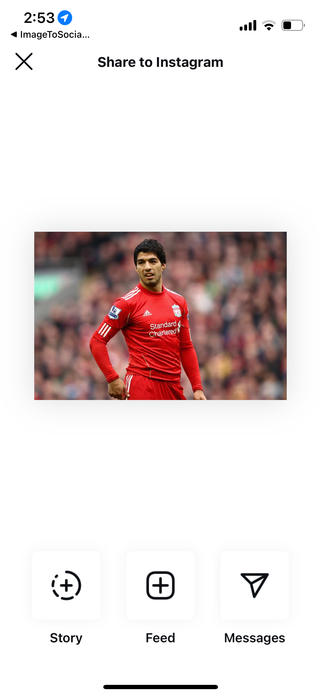
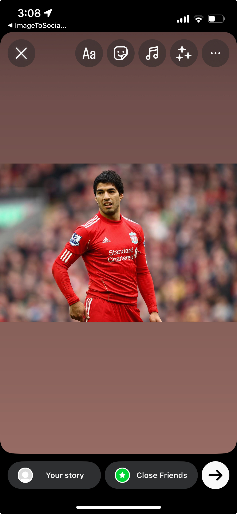

# react-native-image-to-socials

Share images to social networks

## Installation

```sh
npm install react-native-image-to-socials
```

### iOS
1) In your Info.plist ensures that Instagram is authorized
```XML
<key>LSApplicationQueriesSchemes</key>
  <array>
    <string>instagram</string>
    <string>instagram-stories</string>
  </array>
```

2) In your Info.plist ensures that NSPhotoLibraryUsageDescription is set up.
It is used because the function `shareToInstagram` needs to save the image in the Photo Library before being able to forward it to Instagram.

```XML
<key>NSPhotoLibraryUsageDescription</key>
<string>Toto request</string>
```

## Usage

### shareToInstagram(imageUri: string)

```js
import { shareToInstagram } from 'react-native-image-to-socials';

// This opens directly instagram and prompt to use it either as a
// imageUri is local. Check example/App.tsx as an example.
await shareToInstagram(imageUri);
```


### shareToInstagramStory(appId: string, imageUri: string, backgroundImageUri?: string)


```js
import { shareToInstagramStory } from 'react-native-image-to-socials';

// imageUri is local. Check example/App.tsx as an example.

// your appId found in Meta. This opens directly a story post
await shareToInstagramStory(appId, imageUri);
```




## Contributing

See the [contributing guide](CONTRIBUTING.md) to learn how to contribute to the repository and the development workflow.

## License

MIT

---

Made with [create-react-native-library](https://github.com/callstack/react-native-builder-bob)
